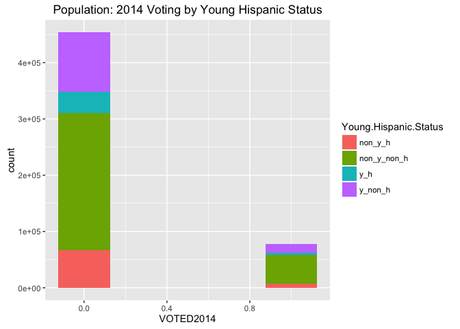
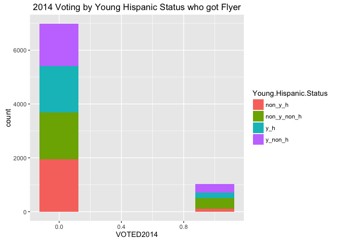
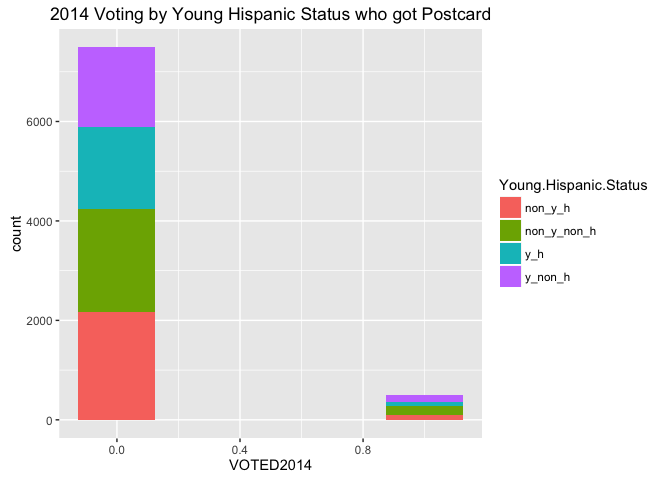
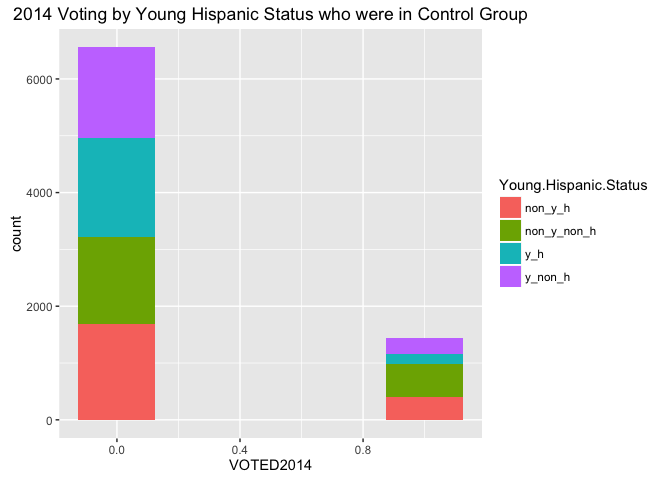
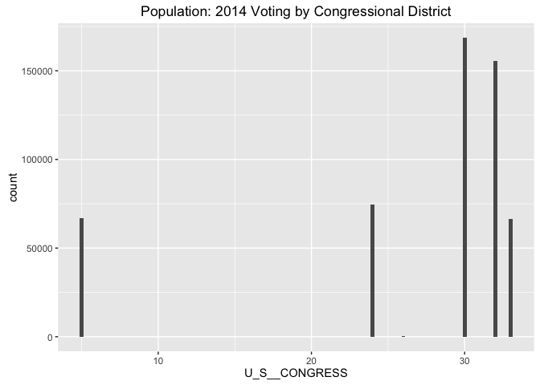
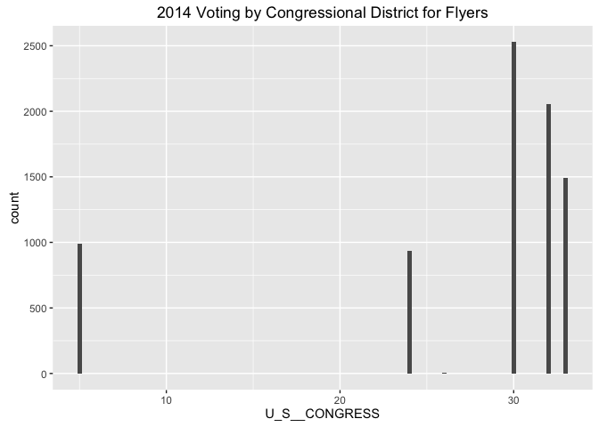
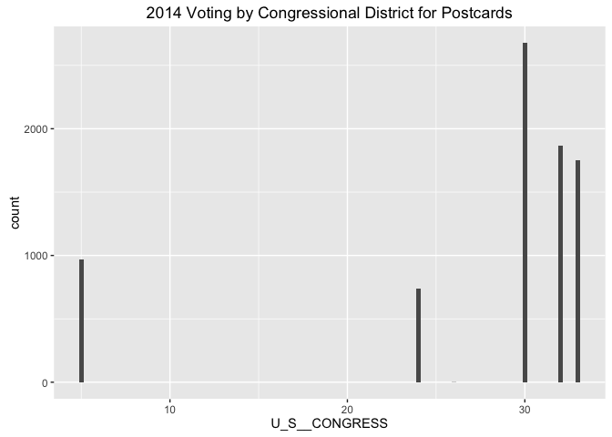
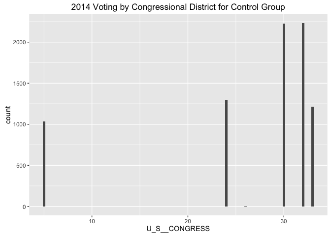

# Garza_Week8_HW
Tony Garza  
July 12, 2016  

#Read in the data and inspect

```r
setwd("~/Dropbox/SMUDataScienceClass/1st class/Week 8/Week8_HW_files")  #important step of setting the working directory
VoterData<-read.csv("LWV_Data.csv")
head(VoterData)
```

```
##   VOTED2014 Young.Hispanic.Status ID.Number Voter.Status Voted.11.2012
## 1         0           non_y_non_h       186            A             0
## 2         0           non_y_non_h       669            A             0
## 3         0           non_y_non_h      1483            A             0
## 4         0           non_y_non_h      1527            A             0
## 5         0           non_y_non_h      1643            A             0
## 6         0           non_y_non_h      1882            A             0
##   Voted.Gen..Elec..09.2010 Voted.Gen..Elec..07.2008
## 1                        0                        0
## 2                        0                        0
## 3                        0                        1
## 4                        0                        1
## 5                        0                        0
## 6                        0                        0
##   Number.General.Elections Hispanic.Surname Young.Voter Eligible.2012
## 1                        0                0           0             1
## 2                        0                0           0             1
## 3                        1                0           0             1
## 4                        1                0           0             1
## 5                        0                0           0             1
## 6                        0                0           0             1
##   Eligible.2010 Eligible.2008 Young.in.2012 Young.in.2010 Young.in.2008
## 1             1             1             0             0             0
## 2             1             1             0             0             0
## 3             1             1             0             0             0
## 4             1             1             0             0             0
## 5             1             1             0             0             0
## 6             1             1             0             0             0
##     Voter.Category type   ID control post flyer LOWPROP       city   zip
## 1 Old Not Hispanic       186      NA   NA    NA       1     DALLAS 75230
## 2 Old Not Hispanic       669      NA   NA    NA       1     DALLAS 75229
## 3 Old Not Hispanic      1483      NA   NA    NA       1 CARROLLTON 75006
## 4 Old Not Hispanic      1527      NA   NA    NA       1 CARROLLTON 75006
## 5 Old Not Hispanic      1643      NA   NA    NA       1    COPPELL 75019
## 6 Old Not Hispanic      1882      NA   NA    NA       1 CARROLLTON 75006
##   U_S__CONGRESS byear
## 1            24  1938
## 2            32  1953
## 3            24  1911
## 4            24  1931
## 5            24  1948
## 6            24  1928
```

```r
summary(VoterData)
```

```
##    VOTED2014      Young.Hispanic.Status   ID.Number       Voter.Status
##  Min.   :0.0000   non_y_h    : 73380    Min.   :    186   A:531735    
##  1st Qu.:0.0000   non_y_non_h:295050    1st Qu.:3294584               
##  Median :0.0000   y_h        : 41739    Median :3857611               
##  Mean   :0.1468   y_non_h    :121566    Mean   :3520479               
##  3rd Qu.:0.0000                         3rd Qu.:4060678               
##  Max.   :1.0000                         Max.   :4216592               
##                                                                       
##  Voted.11.2012    Voted.Gen..Elec..09.2010 Voted.Gen..Elec..07.2008
##  Min.   :0.0000   Min.   :0.00000          Min.   :0.0000          
##  1st Qu.:0.0000   1st Qu.:0.00000          1st Qu.:0.0000          
##  Median :0.0000   Median :0.00000          Median :0.0000          
##  Mean   :0.2506   Mean   :0.01028          Mean   :0.1259          
##  3rd Qu.:1.0000   3rd Qu.:0.00000          3rd Qu.:0.0000          
##  Max.   :1.0000   Max.   :1.00000          Max.   :1.0000          
##                                                                    
##  Number.General.Elections Hispanic.Surname  Young.Voter    
##  Min.   :0.0000           Min.   :0.0000   Min.   :0.0000  
##  1st Qu.:0.0000           1st Qu.:0.0000   1st Qu.:0.0000  
##  Median :0.0000           Median :0.0000   Median :0.0000  
##  Mean   :0.3868           Mean   :0.2165   Mean   :0.3071  
##  3rd Qu.:1.0000           3rd Qu.:0.0000   3rd Qu.:1.0000  
##  Max.   :1.0000           Max.   :1.0000   Max.   :1.0000  
##                                                            
##  Eligible.2012    Eligible.2010    Eligible.2008    Young.in.2012   
##  Min.   :0.0000   Min.   :0.0000   Min.   :0.0000   Min.   :0.0000  
##  1st Qu.:0.0000   1st Qu.:0.0000   1st Qu.:0.0000   1st Qu.:0.0000  
##  Median :1.0000   Median :1.0000   Median :0.0000   Median :0.0000  
##  Mean   :0.7438   Mean   :0.5098   Mean   :0.4382   Mean   :0.3825  
##  3rd Qu.:1.0000   3rd Qu.:1.0000   3rd Qu.:1.0000   3rd Qu.:1.0000  
##  Max.   :1.0000   Max.   :1.0000   Max.   :1.0000   Max.   :1.0000  
##                                                                     
##  Young.in.2010    Young.in.2008               Voter.Category  
##  Min.   :0.0000   Min.   :0.0000   Old Hispanic      : 73380  
##  1st Qu.:0.0000   1st Qu.:0.0000   Old Not Hispanic  :295050  
##  Median :0.0000   Median :0.0000   Young Hispanic    : 41739  
##  Mean   :0.4281   Mean   :0.4685   Young Not Hispanic:121566  
##  3rd Qu.:1.0000   3rd Qu.:1.0000                              
##  Max.   :1.0000   Max.   :1.0000                              
##                                                               
##                   type              ID             control      
##                     :507735   Min.   :    186   Min.   :0.0     
##  Non_y_h_CONTROL    :  2000   1st Qu.:3294584   1st Qu.:0.0     
##  Non_y_h_FLYER      :  2000   Median :3857611   Median :0.0     
##  Non_y_h_POST       :  2000   Mean   :3520479   Mean   :0.3     
##  Non_y_non_h_CONTROL:  2000   3rd Qu.:4060678   3rd Qu.:1.0     
##  Non_y_non_h_FLYER  :  2000   Max.   :4216592   Max.   :1.0     
##  (Other)            : 14000                     NA's   :507735  
##       post            flyer           LOWPROP             city       
##  Min.   :0.0      Min.   :0.0      Min.   :1   DALLAS       :260590  
##  1st Qu.:0.0      1st Qu.:0.0      1st Qu.:1   GARLAND      : 49921  
##  Median :0.0      Median :0.0      Median :1   IRVING       : 43054  
##  Mean   :0.3      Mean   :0.3      Mean   :1   MESQUITE     : 31642  
##  3rd Qu.:1.0      3rd Qu.:1.0      3rd Qu.:1   GRAND PRAIRIE: 25632  
##  Max.   :1.0      Max.   :1.0      Max.   :1   RICHARDSON   : 17203  
##  NA's   :507735   NA's   :507735               (Other)      :103693  
##       zip        U_S__CONGRESS       byear     
##  Min.   :75001   Min.   : 5.00   Min.   :1898  
##  1st Qu.:75062   1st Qu.:24.00   1st Qu.:1961  
##  Median :75201   Median :30.00   Median :1976  
##  Mean   :75152   Mean   :26.98   Mean   :1972  
##  3rd Qu.:75224   3rd Qu.:32.00   3rd Qu.:1987  
##  Max.   :75287   Max.   :33.00   Max.   :1996  
##                                  NA's   :1
```

```r
str(VoterData)
```

```
## 'data.frame':	531735 obs. of  27 variables:
##  $ VOTED2014               : int  0 0 0 0 0 0 0 0 0 1 ...
##  $ Young.Hispanic.Status   : Factor w/ 4 levels "non_y_h","non_y_non_h",..: 2 2 2 2 2 2 2 2 2 2 ...
##  $ ID.Number               : int  186 669 1483 1527 1643 1882 2164 2499 2880 3020 ...
##  $ Voter.Status            : Factor w/ 1 level "A": 1 1 1 1 1 1 1 1 1 1 ...
##  $ Voted.11.2012           : int  0 0 0 0 0 0 0 0 0 1 ...
##  $ Voted.Gen..Elec..09.2010: int  0 0 0 0 0 0 0 0 0 0 ...
##  $ Voted.Gen..Elec..07.2008: int  0 0 1 1 0 0 1 1 1 0 ...
##  $ Number.General.Elections: int  0 0 1 1 0 0 1 1 1 1 ...
##  $ Hispanic.Surname        : int  0 0 0 0 0 0 0 0 0 0 ...
##  $ Young.Voter             : int  0 0 0 0 0 0 0 0 0 0 ...
##  $ Eligible.2012           : int  1 1 1 1 1 1 1 1 1 1 ...
##  $ Eligible.2010           : int  1 1 1 1 1 1 1 1 1 1 ...
##  $ Eligible.2008           : int  1 1 1 1 1 1 1 1 1 1 ...
##  $ Young.in.2012           : int  0 0 0 0 0 0 0 0 0 0 ...
##  $ Young.in.2010           : int  0 0 0 0 0 0 0 0 0 0 ...
##  $ Young.in.2008           : int  0 0 0 0 0 0 0 0 0 0 ...
##  $ Voter.Category          : Factor w/ 4 levels "Old Hispanic",..: 2 2 2 2 2 2 2 2 2 2 ...
##  $ type                    : Factor w/ 13 levels "","Non_y_h_CONTROL",..: 1 1 1 1 1 1 1 1 1 1 ...
##  $ ID                      : int  186 669 1483 1527 1643 1882 2164 2499 2880 3020 ...
##  $ control                 : int  NA NA NA NA NA NA NA NA NA NA ...
##  $ post                    : int  NA NA NA NA NA NA NA NA NA NA ...
##  $ flyer                   : int  NA NA NA NA NA NA NA NA NA NA ...
##  $ LOWPROP                 : int  1 1 1 1 1 1 1 1 1 1 ...
##  $ city                    : Factor w/ 28 levels "","ADDISON","BALCH SPRINGS",..: 7 7 4 4 6 4 7 4 4 10 ...
##  $ zip                     : int  75230 75229 75006 75006 75019 75006 75251 75006 75006 75234 ...
##  $ U_S__CONGRESS           : int  24 32 24 24 24 24 32 24 24 24 ...
##  $ byear                   : int  1938 1953 1911 1931 1948 1928 1926 1919 1924 1944 ...
```
# Finding Abnormalities with the Sample
Because Hispanics and Non-Hispanics vote differently, I thought it would be a good idea to look into this first. The following plots show how the overall population voted and later the voting for each of the Young.Hispanic.Status buckets for the control and flyer and postcard groups.

```r
library(ggplot2)
ggplot(VoterData, aes(x=VOTED2014, fill=Young.Hispanic.Status))+
geom_histogram(binwidth=.25)+labs(title="Population: 2014 Voting by Young Hispanic Status")
```

<!-- -->

```r
flyer<-subset(VoterData, flyer>0)
nrow(flyer)
```

```
## [1] 8000
```
<br\>
As you can see, non-Hispanics dominate the registered voters in Texas. They dominate even more when it comes to actually voting. 

```r
flyertotal<-sum(flyer$VOTED2014)
flyertotal
```

```
## [1] 1021
```

```r
flyertotal/8000
```

```
## [1] 0.127625
```

```r
ggplot(flyer, aes(x=VOTED2014, fill=Young.Hispanic.Status))+
geom_histogram(binwidth=.25)+labs(title="2014 Voting by Young Hispanic Status who got Flyer")
```

<!-- -->


```r
postcard<-subset(VoterData, post>0)
nrow(postcard)
```

```
## [1] 8000
```

```r
postotal<-sum(postcard$VOTED2014)
postotal
```

```
## [1] 508
```

```r
postotal/8000
```

```
## [1] 0.0635
```

```r
ggplot(postcard, aes(x=VOTED2014, fill=Young.Hispanic.Status))+
geom_histogram(binwidth=.25)+labs(title="2014 Voting by Young Hispanic Status who got Postcard")
```

<!-- -->

```r
control<-subset(VoterData, control>0)
nrow(control)
```

```
## [1] 8000
```

```r
controltotal<-sum(control$VOTED2014)
controltotal
```

```
## [1] 1443
```

```r
controltotal/8000
```

```
## [1] 0.180375
```

```r
ggplot(control, aes(x=VOTED2014, fill=Young.Hispanic.Status))+
geom_histogram(binwidth=.25)+labs(title="2014 Voting by Young Hispanic Status who were in Control Group")
```

<!-- -->

<br\>
Each of the samples however, show a distinctly lower percentage of non-Hispanics for each of the groups of 8000. This means the sample is not representative of the population. Also the control group had a higher percentage of non-Hispanics, thus the result that the control did better than the postcard and flyer methods. The postcards and flyers simply went out to people who already vote less than the general population. To be effective they could have targeted Hispanics, for instance, and made the control group say, all Hispanics, and then see if the postcard or flyer method worked to improve that group's voting.

#Congressional District Representation
While the number of hispanics getting flyers and postcards was statistically higher in the sample than the population, I went ahead and looked to see if there was any discrepancy in Congressional District represenation as well. Could be that skewing this data is what skewed the demographics as well.

```r
ggplot(VoterData, aes(x=U_S__CONGRESS))+
geom_histogram(binwidth=.25)+labs(title="Population: 2014 Voting by Congressional District")
```

<!-- -->

```r
ggplot(flyer, aes(x=U_S__CONGRESS))+
  geom_histogram(binwidth=.25)+labs(title="2014 Voting by Congressional District for Flyers")
```

<!-- -->

```r
ggplot(postcard, aes(x=U_S__CONGRESS))+
  geom_histogram(binwidth=.25)+labs(title="2014 Voting by Congressional District for Postcards")  
```

<!-- -->

```r
ggplot(control, aes(x=U_S__CONGRESS))+
  geom_histogram(binwidth=.25)+labs(title="2014 Voting by Congressional District for Control Group")
```

<!-- -->

Turns out there is also an issue that neither the control group nor the flyers and postcards groups are a good statistical match to the population with regards to how people voted per congressional district. Also the control group is way different than the flyer and postcard groups. 
